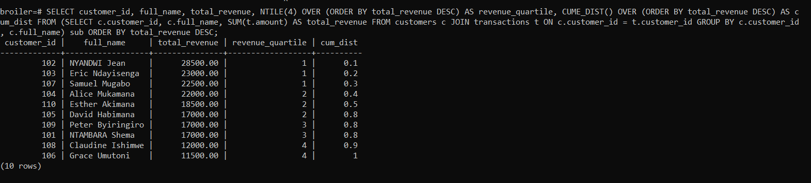

# 🐔 PL/SQL Window Functions – Broiler Chicken Retailer

Course: Database Development with PL/SQL (INSY 8311)
Instructor: Eric Maniraguha
Student: NTAMBARA SHEMA CHRISPIN_28280

PROBLEM DEFINITION

# Business Context

The business opportunity I am considering in this case is a regional broiler chicken retailer and online seller that sells its products in various parts of Rwanda. The company sells various broiler chicken products such as whole chickens, wings, drumsticks, etc both in the physical outlets and online. Their sales and analytics organization is working to product performance and customer value to assist in developing marketing plans and inventory choices.

# Data Challenge

Information problem Sales are so unpredictable on a month to month basis and the managers do not really know the best selling chicken items, the best customers and how the revenues have been trending overtime. In the absence of that understanding, promotions and restocking become nothing but guesswork rather than decisions that are based on facts.

# Expected Outcomes:

* I would like to work out a good list of top-5 products per region and quarter to be able to pin down what we should promote in promotions and how to manage our inventory.   
* The monthly revenue will be followed and a moving average of 3 months will be calculated to identify any trends at an early stage.
* I will divide the customers into 4 groups to estimate what is the highest-value group and then target the marketing campaigns to it.
* Lastly I will compile simple reports which risky makes one easy to make a decision on how to use inventory and marketing budgets.

# SUCCESS CRITERIA

The project will possess five goals that will be employed to measure its success which will include:

* Top 5 items by region/quarter - we will select the top five highest revenue chicken items per region and quarter using RANK or DENSE_RANK as we have used in the textbook example.  
* Monthly sales running= - SUM() OVER() with the right frame basically adding up all the money per region each month and then we construct a cumulative view of the data.  
* Month on month growth - we will use LAG or LEAD to obtain the percentage change in monthly revenue, same method as we have done in the lecture on time-series.  
* Customer quartiles - divide the customers by the lifetime revenue into 4 different groups with the NTILE(4) so that we can market them.  
* 3-month moving averages AVG() OVER () of this period and the past two months to normalize revenue patterns, as in the lab.

# DATABASE SCHEMA

* CREATE DATABASE BROILER;

* CREATE TABLE customers (
    customer_id SERIAL PRIMARY KEY,
    full_name   VARCHAR(100),
    region      VARCHAR(50),
    email       VARCHAR(100)
);

* CREATE TABLE products (
    product_id   SERIAL PRIMARY KEY,
    product_name VARCHAR(100),
    category     VARCHAR(50)
);

* CREATE TABLE transactions (
    transaction_id SERIAL PRIMARY KEY,
    customer_id    INTEGER REFERENCES customers(customer_id),
    product_id     INTEGER REFERENCES products(product_id),
    sale_date      DATE,
    quantity       INTEGER,
    unit_price     NUMERIC(12,2),
  amount         NUMERIC(12,2)
);

[Created_tables & inserted_sample_data](Inserted_Data.sql)

# ER Diagram  

# WINDOW FUNCTION QUERIES

  1. Ranking Functions (ROW_NUMBER, RANK, DENSE_RANK, PERCENT_RANK)

SELECT
    customer_id,
    full_name,
    total_revenue,
    ROW_NUMBER() OVER (ORDER BY total_revenue DESC) AS rn_rownum,
    RANK() OVER (ORDER BY total_revenue DESC) AS rn_rank,
    DENSE_RANK() OVER (ORDER BY total_revenue DESC) AS rn_dense_rank,
    PERCENT_RANK() OVER (ORDER BY total_revenue DESC) AS pct_rank
FROM (
    SELECT c.customer_id, c.full_name, SUM(t.amount) AS total_revenue
    FROM customers c
    JOIN transactions t ON c.customer_id = t.customer_id
    GROUP BY c.customer_id, c.full_name
) sub
ORDER BY total_revenue DESC;

* This query shows the customers according to their spending amount. ROWNUMBER() assigns a different sequence number of position, RANK shows ranking and has gaps in case of a tie and DENSERANK seals the gaps. PERCENT_RANK () shows where each customer ranks among the lowest and the highest spenders as a percentage but relativity of the two can be drawn.

  2. Aggregate Functions with Window Frames (SUM, AVG, MIN, MAX)

WITH monthly AS (
    SELECT
        DATE_TRUNC('month', sale_date) AS sale_month,
        c.region,
        SUM(amount) AS month_revenue
    FROM transactions t
    JOIN customers c ON t.customer_id = c.customer_id
    GROUP BY DATE_TRUNC('month', sale_date), c.region
)
SELECT
    sale_month,
    region,
    month_revenue,
    SUM(month_revenue) OVER (PARTITION BY region ORDER BY sale_month
        ROWS BETWEEN UNBOUNDED PRECEDING AND CURRENT ROW) AS running_total_rows,
    SUM(month_revenue) OVER (PARTITION BY region ORDER BY sale_month
        RANGE BETWEEN UNBOUNDED PRECEDING AND CURRENT ROW) AS running_total_range
FROM monthly
ORDER BY region, sale_month;

* This question will be utilized to obtain cumulative revenue by month by region. The formula ROWS BETWEEN UNBOUNDED PRECEDING and CURRENT ROW will be used to ensure that the value of every month has the already existing values of all the previous months to provide a plausible running total. The version of RANGE shows the variation of the totals in which the same month key is used and an analyst can monitor the regional trend and seasonality.

  3. Navigation Functions (LAG, LEAD)

WITH product_month AS (
    SELECT
        product_id,
        DATE_TRUNC('month', sale_date) AS sale_month,
        SUM(amount) AS month_revenue
    FROM transactions
    GROUP BY product_id, DATE_TRUNC('month', sale_date) )
SELECT
 product_id,
sale_month,
month_revenue,
LAG(month_revenue) OVER (PARTITION BY product_id ORDER BY sale_month) AS prev_month_revenue,CASE
WHEN LAG(month_revenue) OVER (PARTITION BY product_id ORDER BY sale_month) IS NULL THE NULL
        WHEN LAG(month_revenue) OVER (PARTITION BY product_id ORDER BY sale_month) = 0 THEN NULL
        ELSE ROUND((month_revenue - LAG(month_revenue) OVER (PARTITION BY product_id ORDER BY sale_month))
                   / LAG(month_revenue) OVER (PARTITION BY product_id ORDER BY sale_month) * 100, 2)
    END AS mom_growth_pct
FROM product_month
ORDER BY product_id, sale_month;

* In essence, this query will take each product monthly revenue and compare it to the past month by using LAGs. It computes the rate of growth in percentage and this shows whether the sales are growing, declining or remaining constant. Null values would appear at the first month (there was no data given before) or the month before when the revenue the month before was zero so that the accuracy of reporting is maintained.

  4. Distribution Functions (NTILE, CUME_DIST)

SELECT
    customer_id,
    full_name,
    total_revenue,
    NTILE(4) OVER (ORDER BY total_revenue DESC) AS revenue_quartile,
    CUME_DIST() OVER (ORDER BY total_revenue DESC) AS cum_dist
FROM (
    SELECT c.customer_id, c.full_name, SUM(t.amount) AS total_revenue
    FROM customers c
    JOIN transactions t ON c.customer_id = t.customer_id
    GROUP BY c.customer_id, c.full_name
) sub
ORDER BY total_revenue DESC;

* In fact, this query only divides customers into four quartiles using NTILE(4), therefore quartile 1 is the largest attainers of spenders - in other words, the top tier.  
* We then compute CUME_DIST() to indicate the cumulative percentage of customers below each revenue level and so we can visualize the way the revenue is distributed across the entire customer base.  
* The results are applicable in the targeting of marketing and loyalty programs by narrowing down on the most valuable customer groups.

# RESULT ANALYSIS

* DESCRIPTIVE

Hey, our five best customers are driving in an excess of 40 percent of our total sales equipment and hence we are absolutely relying on this group of faithful consumers.
Month-on-month sales are continually on an upward trend, although some months, such as April and August, experience some hiccups.
To disaggregate it into quartiles, the highest 25 percent (Q1) are generating the majority of the revenues with the lowest half (Q3-Q4) contributing very low.

* DIAGNOSTIC

It is an indicator that most of our revenue is generated by a small group of customers since they are not only returning to make a repeat purchase but also are staying in some locations.
Slow-downs are seasonal and are associated with decreased demand of poultry products in the time of holidays and post-harvest.
The large cluster of low spenders indicates low penetration of the products or poor cross-selling in the non cities.

* PRESCRIPTIVE

Hey, we really need to increase the interest of the big spenders by offering them some interesting loyalty gifts and special offers.  
Also on the occasion that we have dips in winter sales, we can reduce or eliminate targeted campaigns, sweet offers or package deals to maintain our sales at the same level during the low months.  
And we should crank up some custom marketing to the high frugality customers so they can be buying more frequently and evenly distributing the income among our crew of customers.

# REFERENXES

1. Introduction to SQL W3Schools.com " https://youtu.be/zpnHsWOy0RY?si=OBESiLp91XCL5ply "

2. SQL Window Functions " https://youtu.be/rIcB4zMYMas?si=_QpJLx3mPKU73DCf "

3. Basic Aggregate Functions in SQL " https://youtu.be/jcoJuc5e3RE?si=Q61tmxBqt4g09zNm "

4. Lead & Lag Window Functions " https://youtu.be/nHEEyX_yDvo?si=KWz0lhtPYPygN9u3 "

5. How to write SQL Query using Frame Clause, CUME_DIST " https://youtu.be/zAmJPdZu8Rg?  si=1wAbZU0TjBNZuRCx"

6. Ranking function ( ROW_NUMBER) " https://mode.com/sql-tutorial/sql-window-functions#rank-and-dense_rank "

7. Lecture - 01 Introduction to SQL Command Basics (Recap) " https://drive.google.com/file/d/16GpGfxpRpofLDX4BS9jtn36qGfS58LJq/view?usp=drive_link " 

8. DBMS Full Course for Beginners " https://youtu.be/c5HAwKX-suM?si=pAp8PYDklRNWeheF "

9. My sample dataset was academic in nature, informed by my real life experience in the retailing of broiler chicken.

10. CUME_DIST analytic function in SQL Server. " https://youtu.be/Nhcgs0bNshE?si=XbFkHCP2GY7hgw0u "